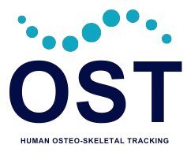

# 🦴 OST – Osteo-Skeletal Tracking



[](https://www.python.org/)
[](LICENSE.md)
[](https://ai.google.dev/edge/mediapipe/solutions/guide)

**OST (Osteo-Skeletal Tracking)** is an experimental framework that combines **Intel RealSense** depth sensing with **MediaPipe Pose** to detect, track, and record human skeletal movement in real time.  
It serves as a foundation for **motion analysis**, **biomechanics research**, and future **machine learning applications**.

---

## 🎯 Project Goals
- Capture synchronized **color + depth** streams from an Intel RealSense camera.  
- Apply **MediaPipe Pose** to extract **33 human landmarks**.  
- Save processed data in **CSV format** for offline analysis.  
- Provide an **extendable base** for real-time skeleton analytics and visualization.  

---

## 🧩 Tech Stack
| Component | Purpose |
|------------|----------|
| **Python 3.12.3** | Core programming language |
| **MediaPipe** | Pose estimation / skeleton tracking |
| **OpenCV** | Frame processing & visualization |
| **pyrealsense2** | Access Intel RealSense streams |
| **NumPy & CSV** | Data manipulation and export |

---

## ⚙️ Installation

### 1. Clone the repository
```bash
git clone https://github.com/baxasd/OST.git
cd OST
````

### 2. Create vistual environment and install dependencies

```bash
python -m venv .venv
source .venv/bin/activate
pip install -r requirements.txt
```

> ⚠️ **Note:** Tested only on **Python 3.12.3**. Other versions may not be compatible.

### 3. Install pip package and run

```bash
pip install .
ost-realsense -h
```

---

## 📂 Project Structure

```
OST/
├─ assets/         # Logos, images
├─ data/           # CSV exports
├─ src/            # Core Python scripts
├─ requirements.txt
└─ main.py
```

---

## 🚀 Future Enhancements

* Integrate **machine learning models** for activity recognition.
* Real-time **3D skeleton visualization**.
* Multi-person tracking support.
* Export to **other formats** like JSON or Parquet.